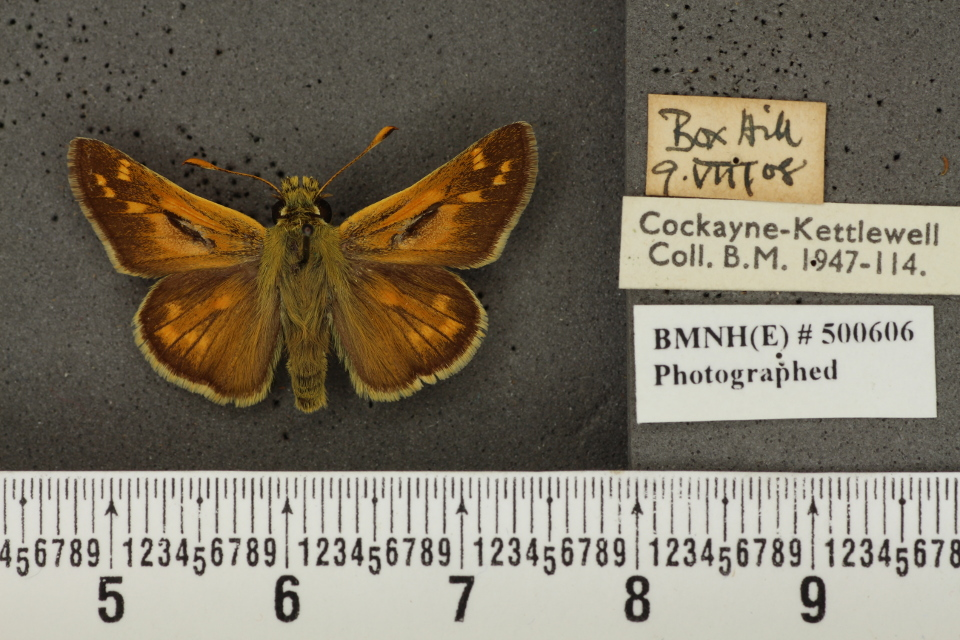
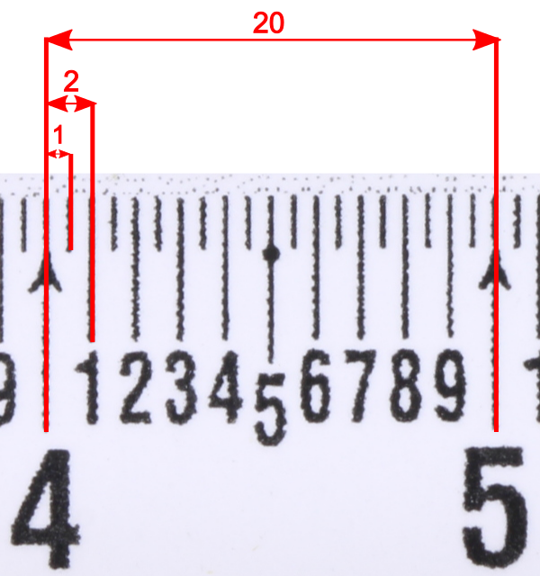

Determining image scale from a ruler
====================================

Given an image such as the one below, there are three things needed to determine the scale factor, enabling conversion between pixel measurements and real world measurements.

	Specimen image

* **A visible ruler in the image**: without this there is no way to automatically anchor the size of the specimen in real world space. 
* **The pattern of the ruler's graduations**: as shown below, this is the relationship between the graduations on the ruler with respect to the smallest gap. For this example, the half-millimeter gap is between the smallest lines, there is *twice* this between the millimeter lines, and *twenty times* this between the centimeter lines. 
* **Distance between the smallest graduations**: for this example it is 0.5mm.

    Ruler graduations

A simple example is given of how this might be used, with the parameters being as seen above. By manually measuring the distance between the smallest graduations (approximately 7.566 pixels) it is confirmed that this results in a real world distance of 0.5mm, as specified. Note that units remain the same and so it is not necessary to specify them.

..  code:: python

	import cv2
	from vision.ruler_detection.find_scale import ruler_scale_factor

	image = cv2.imread('specimen_image.jpg')
	scale_factor = ruler_scale_factor(image, graduations=[1, 2, 20], distance=0.5)
	pixel_distance = 7.566
	real_distance = pixel_distance * scale_factor

..  code:: python

	>>> print(real_distance)
	0.50002001856